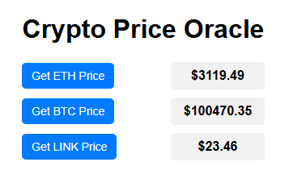

# **Crypto Price Oracle Website**

This project allows users to fetch and display the latest cryptocurrency prices (ETH, BTC, etc.) using **Chainlink price oracles** and a **Solidity smart contract**. It provides a simple web interface to display real-time prices of various crypto assets. While there are other simpler and more straightforward approaches to fetching cryptocurrency prices—such as using centralized APIs. The main reason for this decision was to explore and test Chainlink’s decentralized oracle network. By using Chainlink, we could ensure the accuracy, security, and decentralization of price data, which is crucial for building trust in smart contracts. Additionally, this provided an opportunity to integrate and experiment with Chainlink’s technology, even though simpler alternatives might have sufficed for the specific use case of fetching crypto asset prices.

## **Project Overview**

This project consists of:
1. **Solidity smart contract**: Fetches real-time prices for different cryptocurrencies using Chainlink oracles.
2. **Frontend**: Displays the prices using HTML and JavaScript, connected to the smart contract via Web3.js.

---

## **Technology Stack**

- **Solidity**: Used for smart contract development.
- **Chainlink Oracles**: Fetches real-time price data (ETH/USD, BTC/USD, etc.).
- **HTML/CSS**: For the frontend interface.
- **JavaScript (Web3.js)**: To interact with the Ethereum blockchain and the deployed smart contract.

---

## **Features**

- Fetch the latest prices of **ETH**, **BTC**, and **LINK** from Chainlink oracles.
- The **Solidity contract** ensures prices are fetched securely from decentralized price feeds.
- **Web frontend** displays live prices to users.

---

## **How to Run**

### **Deploy the Smart Contract:**

- Compile and deploy the contract using **Foundry**.
- Use the script `DeployCryptoPriceOracle.sol` for deploying the contract to a testnet like **Sepolia**.

### **Run the Frontend:**

- Replace the `contractAddress` and `abi` in `index.html` with your contract's address and ABI.
- Open the HTML file in a browser that supports **Web3** (e.g., with **MetaMask**).

---

## **Future Improvements**

- **Add More Assets**: Add more tokens like **Dogecoin**, **Litecoin**, etc., using additional **Chainlink price feeds**.
- **Styling**: Improve the frontend design using frameworks like **Bootstrap** or **TailwindCSS**.

---

## **Conclusion**

This project demonstrates how to create a basic decentralized crypto price tracker using **Chainlink oracles** and **Solidity**. It also highlights how to fetch real-time price data and display it on a web interface using **Web3.js**.

## **Final Result**

